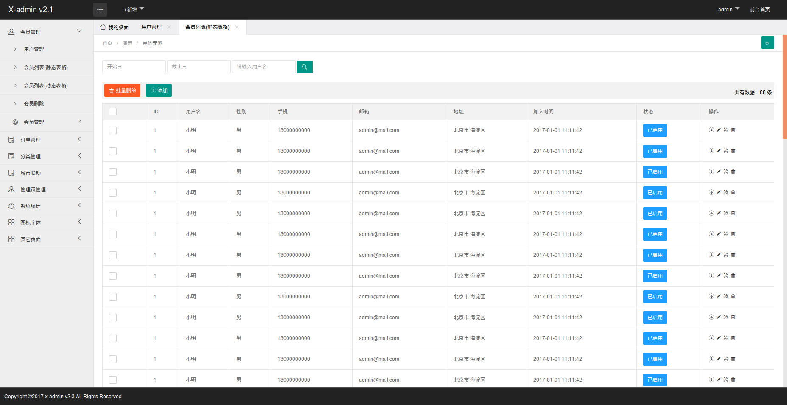

# myGoProject(下载请根据分支版本最新的下载)

## 1. go版本介绍：go1.11.5
   go下载链接: https://pan.baidu.com/s/1sFEKwQOB8xVnvzD0qQVuPg 提取码: 25mb 
   
## 2. mongodb version 3.4.20
   安装如果碰到问题请看下面的常见问题解答：
    

## 3. 前端 view html version  开源html 使用layui 

http://localhost:8888/myproject/login.html

## 4. 使用jwt 进行token验证 鉴权

Token 缺少Token
{
    "code": 2001,
    "data": null,
    "msg": " 缺少 token "
}

Token 验证失败
{
    "code": 2002,
    "data": null,
    "msg": "token 验证失败"
}

## 5. 数据配置
   采用自动生成数据表的方式，通过添加struct 后保存到数据库时自动生成数据表格。

#
本人博客：https://blog.csdn.net/u010919083

# 常见问题解答：
##1.数据库配置所在目录
  ./conf/app.ini 中配置您的数据库地址用户名和密码
##2.数据接口管理
在routers中路由配置
##3.mongo数据库安装报错：
1.mongodb-org-server : Depends: libcurl3 (>= 7.16.2) but it is not going to be installed
解决办法：https://blog.csdn.net/u010919083/article/details/100556585

标记：
